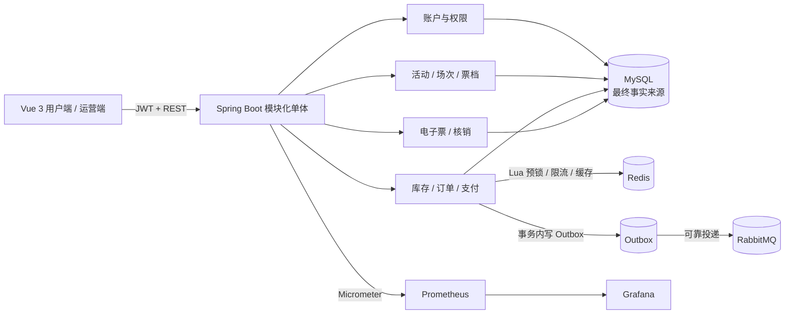
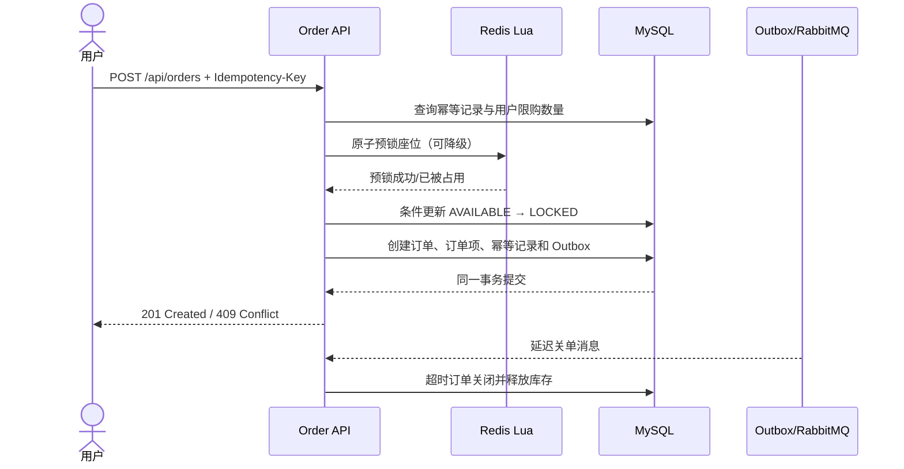
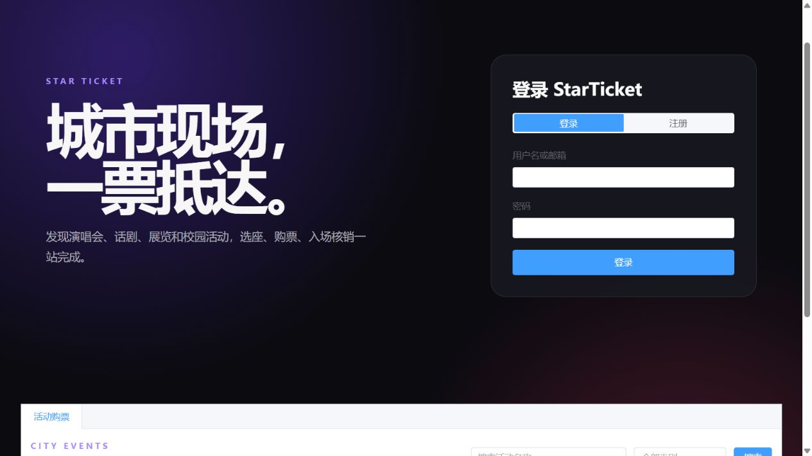
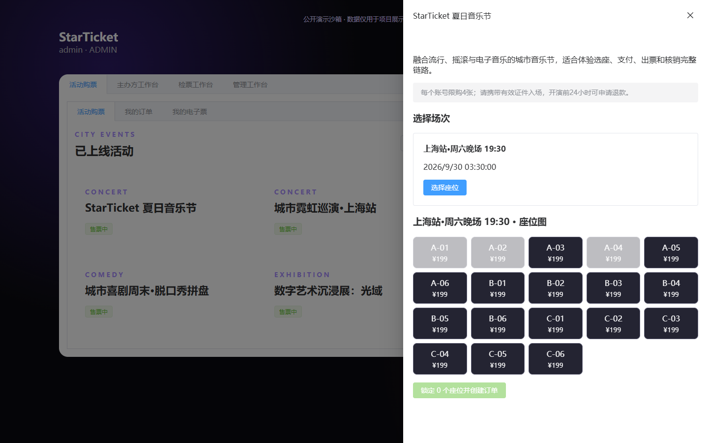
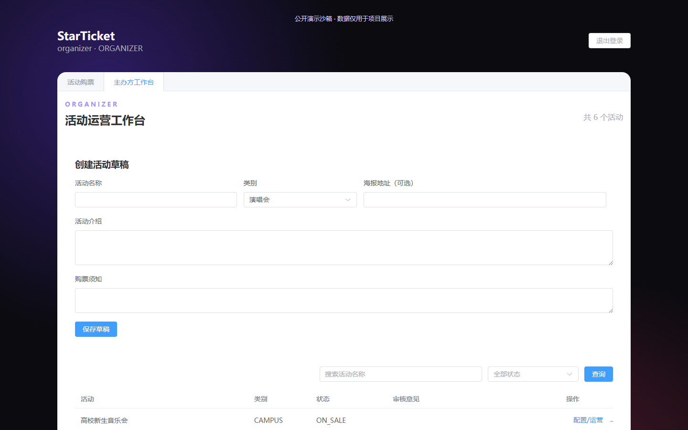
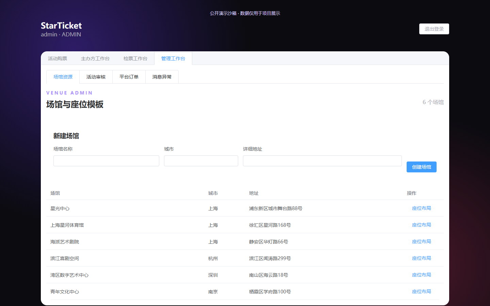

# StarTicket 城市演出票务平台

[](https://github.com/InInNHD/starticket/actions/workflows/ci.yml)
[](https://github.com/InInNHD/starticket/releases)
[](backend/pom.xml)
[](backend/pom.xml)

面向城市演出与校园活动的 Java 票务交易平台，完整实现“活动发布 → 选座锁座 → 下单支付 → 电子票 → 入场核销 → 取消退款”，重点验证并发一致性、接口幂等和消息可靠性。

## 一分钟了解

| 维度 | 项目证据 |
|---|---|
| 业务闭环 | 用户、主办方、管理员、检票员四角色；覆盖发布、审核、售票、支付、退款与核销 |
| 并发正确性 | Redis Lua 可选预锁 + MySQL 条件更新最终兜底；限购、幂等回调、单次核销均有并发测试 |
| 消息可靠性 | 本地事务 Outbox、RabbitMQ 延迟关单、失败重试、死信落库与人工重放 |
| 可验证性 | 23 项流程/真实依赖测试，18 轮固定资源压测，无重复座位、无超卖 |

```bash
docker compose up -d --build
# Web: http://localhost:8081  |  体验账号: user / Password123
```

[查看页面截图](#页面截图) · [阅读架构方案](docs/02-architecture.md) · [查看真实性能报告](docs/03-performance-report.md) · [打开 Swagger](http://localhost:18080/swagger-ui.html)

## 项目定位

- 求职方向：Java 后端开发
- 架构形态：按业务模块组织的单体应用
- 开发策略：先保证数据库交易闭环，再加入 Redis、RabbitMQ、限流和监控
- 核心难点：座位库存、订单状态、接口幂等、超时释放、支付回调、票码核销

## 技术栈

`Java 21` · `Spring Boot 3.5` · `Spring Security/JWT` · `JPA/JdbcTemplate` · `MySQL 8.4` · `Redis 7` · `RabbitMQ 4` · `Flyway` · `Vue 3/TypeScript` · `Docker Compose` · `Testcontainers` · `Prometheus/Grafana` · `GitHub Actions`

## 系统架构



采用模块化单体而不是微服务：账户、活动、库存、订单、支付和票务按包边界隔离，但共享一个进程和数据库事务，便于应届生项目把业务闭环、并发正确性和可观测性做深。

## 核心下单时序



## 页面截图

| 登录与公开活动 | 用户选座 |
|---|---|
|  |  |

| 主办方工作台 | 管理员工作台 |
|---|---|
|  |  |

## 第一版模块

```text
account       账户、认证和角色
venue         场馆、区域和座位模板
event         活动、场次和票档
inventory     场次座位、锁座和释放
order         订单、订单项和退款申请
payment       模拟支付和幂等回调
ticket        电子票、票码和入场核销
admin         活动审核和失败消息重放
```

模块使用包边界隔离，不为每个模块单独部署。首版只有一个后端进程、一个 MySQL、一个 Redis 和一个 RabbitMQ。

## 文档

- [需求规格](docs/01-requirements.md)
- [架构与技术方案](docs/02-architecture.md)
- [真实性能测试报告](docs/03-performance-report.md)

## 本地启动

环境要求：JDK 21、Maven 3.9+、Node.js 22+、Docker Desktop。

```bash
# 构建并启动前端、后端、MySQL、Redis、RabbitMQ、Prometheus 和 Grafana
docker compose up -d --build
```

- Web：`http://localhost:8081`
- Swagger：`http://localhost:18080/swagger-ui.html`
- 健康检查：`http://localhost:18080/actuator/health`
- Prometheus：`http://localhost:9090`
- Grafana：`http://localhost:13000`
- RabbitMQ 管理页：`http://localhost:15672`

只进行本地开发时，也可以先执行 `docker compose up -d mysql redis rabbitmq`，然后分别运行 `mvn spring-boot:run` 和 `npm run dev`。

生产或共享环境必须通过 `STARTICKET_JWT_SECRET` 提供至少 32 字节的随机 JWT 密钥；未配置时应用只为本地开发生成一次性随机密钥。

Docker Compose 默认开启本地 demo 数据，四个账号密码均为 `Password123`：`admin`、`organizer`、`checker`、`user`。同时会初始化一个场馆、活动、场次、票档和 18 个座位。共享或生产环境设置 `STARTICKET_DEMO_ENABLED=false`。

如果浏览器提示拒绝连接，先确认 Docker Desktop 已启动，再执行：

```bash
docker compose ps
docker compose logs backend --tail 100
```

当前活动发布链路为：管理员建立场馆/区域/座位模板 → 主办方创建活动草稿 → 添加场次 → 按场馆区域配置票档 → 提交审核 → 管理员通过或驳回 → 普通用户查看已公开活动。

完整交易链路为：用户选择场次与座位 → Redis Lua 预锁 → MySQL 条件锁座 → 幂等创建待支付订单 → Outbox 发布超时消息 → 模拟支付回调 → 座位售出并生成电子票 → 检票员单次核销；取消、超时或退款会按状态释放库存。

## 核心难点与实现

| 难点 | 实现 | 验证方式 |
|---|---|---|
| 并发超卖 | Redis Lua 提前削峰，MySQL 条件更新和唯一约束最终兜底 | 100 线程争同一座位 + SQL 全库断言 |
| 拆单绕过限购 | 事务内统计待支付/已支付票数，结合场次级互斥更新 | 同一用户并发创建订单测试 |
| 重复请求和回调 | 幂等键唯一约束、状态机校验、冲突后回读既有结果 | 并发幂等下单、支付回调、退款和核销测试 |
| 消息可靠性 | 业务事务写 Outbox，原子抢占发布，失败重试、死亡记录与人工重放 | RabbitMQ 中断恢复测试 |
| Redis 可用性 | 活动冷缓存回源 MySQL；Redis 故障时缓存、限流和预锁自动降级 | 真实 Redis 停机与冷/热缓存 Testcontainers 测试 |
| 多角色运营闭环 | 用户、主办方、管理员、检票员四类权限和审计日志 | Testcontainers 端到端流程测试 |
| 故障定位 | Problem Details 携带 requestId，Prometheus 指标和预置 Grafana 看板 | 集成测试与 Docker 冒烟验证 |

## 设计取舍

- MySQL 是库存最终事实来源，Redis 只在热点抢票时承担预锁和削峰；Redis 不可用时允许降级到数据库条件更新。
- 使用本地事务 + Outbox 保证订单和待发送事件一起提交，接受消息的最终一致性，避免在单体项目中引入分布式事务框架。
- 保留模块化单体，避免为展示技术而拆微服务；当压测证明单体资源或团队边界成为瓶颈时再拆分。
- 支付采用签名模拟回调，重点验证支付单唯一性、回调幂等和订单状态流转，不在求职项目中伪装真实支付资质。

## 压测结论

测试使用专用 Compose 将服务端固定在 4 vCPU / 8 GB 预算内，准备 300 个预热专用用户、1000 个正式专用用户、5000 个座位以及互不复用的预热/正式场次。两种方案在 300 并发下对 1、100、1000 个座位各执行 3 轮，每轮固定 1000 次请求。18 轮的 `429`、`5xx`、传输错误、重复座位和超卖均为 0，SQL 全局断言为 `PASS`。

| 场景 | MySQL 成功 / 冲突吞吐 | Redis + MySQL 成功 / 冲突吞吐 | `201 / 409` | 结论 |
|---|---:|---:|---:|---|
| 1 个座位 | 0.15 / 150.53 req/s | 0.14 / 139.62 req/s | 1 / 999 | 总吞吐几乎全是冲突拒绝，不能代表成功交易能力 |
| 100 个座位 | 21.38 / 192.38 req/s | 19.39 / 174.50 req/s | 100 / 900 | Redis 成功吞吐约低 9.3% |
| 1000 个分散座位 | 214.34 / 0 req/s | 193.80 / 0 req/s | 1000 / 0 | Redis 成功吞吐约低 9.6% |

旧测试的正式场次已被预热售空，所谓“Redis 吞吐提升 41.8%”实际是更快返回 `409`，现已删除该无效结论。本轮没有证明 Redis 路径更快，因此默认采用 MySQL 条件更新，只把 Redis 预锁保留为需要重新压测验证的可选热点策略。完整环境、6 组中位数、18 轮原始结果和 SQL 断言见[性能测试报告](docs/03-performance-report.md)。

## 测试与验证

```bash
# 23 个流程及真实依赖并发测试
cd backend && mvn test

# 前端类型检查和生产构建
cd frontend && npm ci && npm run build

# 固定 4 vCPU / 8 GB、独立预热场次的完整库存压测（PowerShell 7）
./load/Prepare-Sustained.ps1
./load/Run-Sustained.ps1

# 热门活动详情 500 并发验收
java load/OrderRace.java --event-details http://localhost:18081 1 500 10 30 load/results/event-details-c500-r1.json
```

## 可直接放入简历的项目描述

- 基于 Java 21、Spring Boot、MySQL、Redis 与 RabbitMQ 实现城市演出票务闭环，覆盖活动审核、选座锁座、幂等下单、支付回调、电子票核销、取消退款及四角色权限。
- 设计 Redis Lua 预锁 + MySQL 条件更新的双层库存方案，以数据库作为最终一致性防线；在固定 4 vCPU / 8 GB 环境完成 18 轮库存测试，分别统计成功/冲突吞吐与状态码，验证当前负载下 Redis 路径成功吞吐低 9%～10%，据此保留热点按需启用策略，全程无重复座位和超卖。
- 使用事务 Outbox、延迟消息、失败重试/死信重放解决订单超时与消息可靠性，并通过 Testcontainers 覆盖并发幂等下单、支付回调、退款和单次核销，接入 Prometheus、Grafana 与 requestId 追踪提升可观测性。

## 当前进度

- [x] Maven、Vue 和 Docker Compose 工程骨架
- [x] Flyway 账户表迁移
- [x] 用户注册、登录、JWT 签发与受保护的当前用户接口
- [x] 注册/登录前端页面
- [x] 账户完整流程集成测试
- [x] 场馆、区域、规则化座位模板和管理页面
- [x] 活动、场次、区域票档、提交审核、审核通过/驳回和公开查询
- [x] 场次座位快照、数据库条件锁座、幂等订单、取消和超时释放
- [x] 模拟支付、签名回调、电子票、单次核销和整单模拟退款
- [x] Redis Lua 预锁、热点缓存、限流和数据库降级
- [x] RabbitMQ 延迟关单、Outbox 重试、死信查询和定时补偿
- [x] Testcontainers 真实 MySQL、Redis、RabbitMQ 并发一致性测试
- [x] Prometheus 业务指标、Grafana 预置仪表盘、Swagger 和 GitHub Actions
- [x] 固定 4 vCPU / 8 GB，独立预热/正式场次的 MySQL-only 与 Redis Lua + MySQL 三轮性能对比
- [x] 18 轮固定库存测试分项统计 `201/409/429/5xx`，SQL 断言无重复座位和超卖
- [x] 热门活动详情 500 并发三轮验收，36768 次正式请求无服务端错误
- [x] 活动与订单服务端搜索分页、主办方销售看板和管理员订单查询
- [x] 草稿场次编辑停用、票档编辑启停和运营查询索引
- [x] 活动取消、管理员下架、演出结束后自动结束活动
- [x] Outbox 多实例原子抢占、超时恢复、消费死信落库重放和关键操作审计
- [x] 统一 Problem Details 与 requestId 追踪、Swagger JWT 授权和 Grafana 运行监控
- [x] 23 个高价值流程及真实依赖并发测试，覆盖权限、归属、签名、状态竞争、冷缓存和 Redis 故障降级

## 版本边界

首版不接入真实支付、不拆微服务、不做分库分表、不做推荐算法、不支持复杂优惠券。等完整闭环、测试和压测完成后，再根据实际瓶颈决定是否增加。
