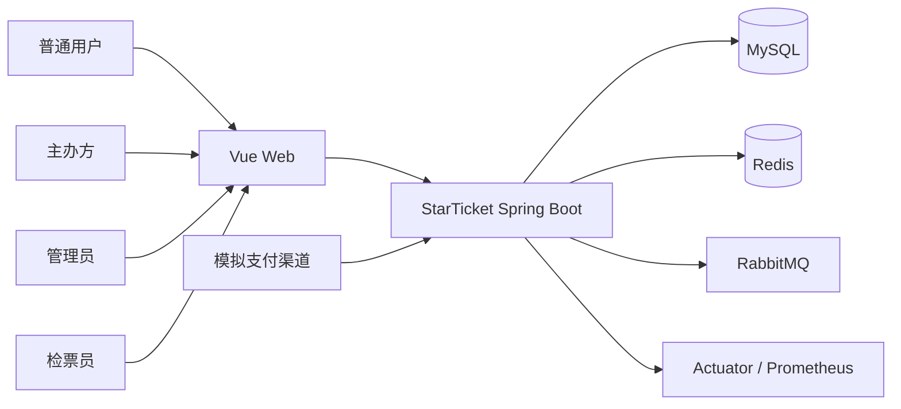
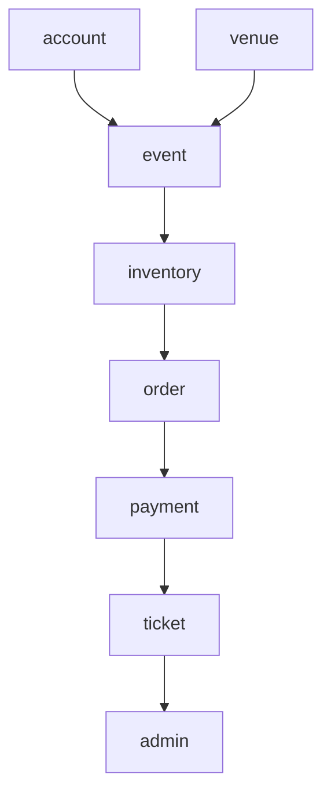
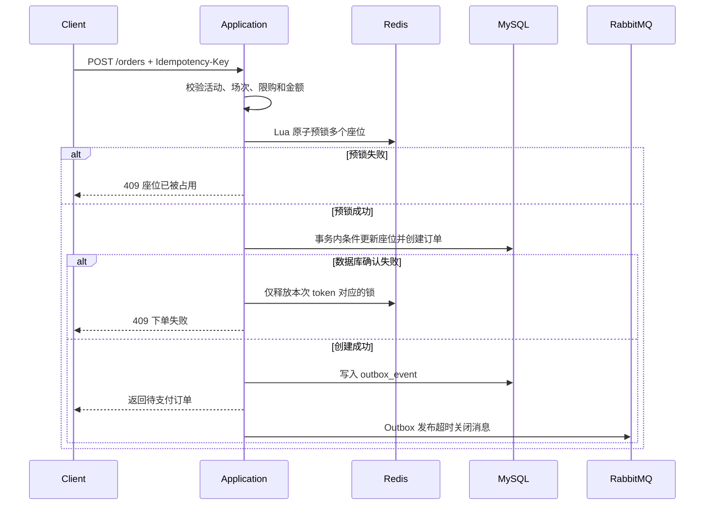

# StarTicket 架构与技术方案

## 1. 架构决策

StarTicket 首版采用模块化单体。所有业务模块在一个 Spring Boot 应用中运行，但代码按业务能力划分包边界，模块间通过公开应用服务或领域事件协作。

选择理由：

- 一人可以完成开发、测试和部署。
- 本地事务足以保证订单和座位的核心一致性。
- 减少服务发现、远程调用和分布式事务带来的非业务工作。
- 将来只有在出现独立扩缩容或团队边界时才拆服务。

## 2. 系统上下文



## 3. 后端模块关系



依赖规则：

- `account` 和 `venue` 不依赖交易模块。
- `inventory` 不直接修改支付状态。
- `payment` 只通过订单公开服务确认支付结果。
- `ticket` 只消费支付成功或退款成功事件。
- 控制器不能跨模块直接访问其他模块的 Repository。
- 不创建只有一个实现的 Service 接口。

## 4. 技术栈决策

| 领域 | 选择 | 原因 |
|---|---|---|
| JDK | Java 21 | LTS，支持现代语言与运行时特性 |
| 应用框架 | Spring Boot 3.5.x | Java 17+ 生态成熟，适合求职和部署 |
| Web | Spring MVC | 阻塞式数据库访问场景简单可靠 |
| 持久化 | Spring Data JPA | 减少常规 CRUD；关键库存操作使用条件更新 SQL |
| 数据库 | MySQL 8.4 | 订单、库存和状态数据的最终事实来源 |
| 缓存与预锁 | Redis 7 | 活动详情缓存、下单限流和座位预锁 |
| 消息队列 | RabbitMQ 4 | 延迟关单、重试和死信处理 |
| 安全 | Spring Security + JWT | RBAC、无状态 API 认证 |
| 数据迁移 | Flyway | 可复现、可审查的数据库结构变更 |
| API 文档 | springdoc-openapi | 本地直接生成 Swagger UI |
| 监控 | Actuator + Micrometer | 暴露健康状态和业务指标 |
| 测试 | JUnit 5 + Testcontainers | 使用真实 MySQL 验证事务和锁语义 |
| 压测 | k6 + Java 21 标准库 | 脚本可版本化，无 k6 时仍可复现并发对比 |
| 前端 | Vue 3 + TypeScript | 快速完成用户端和管理端 |
| 部署 | Docker Compose | 一条命令启动完整开发环境 |

依赖版本由 Spring Boot BOM 统一管理，非必要不单独覆盖版本。

JWT 由应用使用 Spring Security 内置的 Nimbus 组件签发和校验，首版不额外部署授权服务器。RabbitMQ 的固定 10 分钟关单使用消息 TTL + 死信交换机实现，不依赖延迟消息插件。

## 5. 核心数据模型

### 5.1 账户和权限

- `st_user`：账号、密码摘要、昵称、状态
- `st_user_role`：用户与角色关系

### 5.2 场馆和活动

- `st_venue`：场馆基本信息
- `st_venue_area`：看台、楼层或区域
- `st_seat`：座位模板，包含区域、排、号
- `st_event`：活动主体和审核状态
- `st_performance`：具体演出场次和售票时间
- `st_ticket_tier`：票档名称、价格、颜色和限购规则

### 5.3 库存和订单

- `st_performance_seat`：场次座位快照、票档、价格、状态、锁定订单和版本号
- `st_order`：订单号、用户、金额、状态、支付截止时间
- `st_order_item`：订单中的座位和成交价快照
- `st_idempotency_record`：请求幂等键、请求摘要和业务结果

`st_performance_seat` 对 `(performance_id, seat_id)` 建唯一索引。锁座使用类似以下条件更新作为最终防线：

```sql
UPDATE st_performance_seat
SET status = 'LOCKED', locked_order_id = ?, lock_expires_at = ?, version = version + 1
WHERE performance_id = ?
  AND seat_id IN (...)
  AND status = 'AVAILABLE';
```

受影响行数必须等于用户请求座位数，否则事务回滚。

### 5.4 支付、票和核销

- `st_payment`：支付单、订单、金额、状态和渠道流水号
- `st_refund`：退款单和状态
- `st_ticket`：电子票、随机票码摘要和状态
- `st_check_in_record`：核销结果、操作员、场次和时间
- `st_outbox_event`：待发布的领域事件

## 6. 并发锁座方案

### 6.1 正确性边界

MySQL 是库存事实来源。Redis 预锁只用于提前拦截冲突和降低数据库热点，Redis 成功不等于购票成功。基准测试表明当前单实例规模下预锁会增加约 9% 开销，因此默认关闭，通过 `STARTICKET_REDIS_PRELOCK_ENABLED=true` 才启用。

### 6.2 请求流程



Redis 锁值必须包含随机 token，释放时通过 Lua 校验 token，避免删除其他请求重新建立的锁；关闭预锁不影响活动缓存和下单限流。

## 7. 消息可靠性

业务事务与 RabbitMQ 不能使用同一个本地事务，因此采用 Outbox：

1. 创建或更新业务数据时，在同一 MySQL 事务写入 `outbox_event`。
2. 后台发布器通过 `FOR UPDATE SKIP LOCKED` 原子抢占未发布事件，多实例不会同时处理同一行；抢占超时会自动恢复。
3. Broker 确认后将事件标记为已发布。
4. 发布失败保留记录并指数退避重试。
5. 关单消费者使用订单状态条件更新，重复消息不会重复释放库存。
6. 超过重试次数的消息进入死信队列，由管理员查看和重放。

数据库 Outbox 发布失败与 RabbitMQ 消费失败分别处理：前者保存在 `st_outbox_event`，后者从 Broker 死信队列采集到 `st_failed_message`。两类失败均支持管理端重试，并写入 `st_audit_log`。

Outbox 当前用于订单创建后的延迟关单事件，不把普通查询做成消息流。

## 8. 缓存策略

首版只缓存活动详情：5 分钟 TTL，活动修改时主动删除。实时座位状态直接查询 MySQL，不长期缓存完整座位图。下单限流使用 Redis 窗口计数。Redis 连接或命令超过 1 秒即快速失败，缓存查询、限流和座位预锁捕获故障并回退 MySQL，避免降级路径长时间阻塞业务线程。

不使用“缓存更新 + 数据库更新”双写。业务写入数据库成功后删除相关缓存，短暂不一致由 TTL 兜底。

## 9. API 边界

每个 HTTP 请求接受或生成 `X-Request-Id`。业务异常、参数错误以及 Security 产生的 401/403
统一返回 RFC 9457 Problem Details，并包含相同 `requestId`。请求完成日志通过 MDC 自动携带
`requestId`、认证用户和 URL 中的订单号、支付单号或活动编号，便于从前端错误直接定位服务端日志。

Swagger 定义全局 JWT Bearer 安全方案，可在 Swagger UI 使用 `Authorize` 调试受保护接口。
Prometheus 采集业务指标以及 Spring MVC、JVM 和 HikariCP 指标，Grafana 对 HTTP 错误率、
资源使用和死信数量提供预置面板；告警规则覆盖后端不可用、持续 5xx、Outbox 死亡/积压和 Redis 降级。

### 用户端

```text
POST   /api/auth/register
POST   /api/auth/login
GET    /api/events
GET    /api/events/{eventId}
GET    /api/performances/{performanceId}/seats
POST   /api/orders
GET    /api/orders
GET    /api/orders/{orderNo}
POST   /api/orders/{orderNo}/cancel
POST   /api/payments
POST   /api/payments/callback
POST   /api/payments/{paymentNo}/simulate-success
POST   /api/orders/{orderNo}/refunds
GET    /api/tickets
```

### 主办方和管理端

```text
POST   /api/organizer/events
GET    /api/organizer/events
GET    /api/organizer/events/{eventId}
PUT    /api/organizer/events/{eventId}
POST   /api/organizer/events/{eventId}/performances
PUT    /api/organizer/performances/{performanceId}
POST   /api/organizer/performances/{performanceId}/cancel
POST   /api/organizer/performances/{performanceId}/tiers
PUT    /api/organizer/tiers/{tierId}
POST   /api/organizer/events/{eventId}/submit
POST   /api/organizer/events/{eventId}/cancel
GET    /api/organizer/events/{eventId}/sales-summary
GET    /api/organizer/events/{eventId}/orders
GET    /api/organizer/venues
GET    /api/organizer/venues/{venueId}/layout
GET    /api/admin/events/pending
GET    /api/admin/events
GET    /api/admin/events/{eventId}
POST   /api/admin/events/{eventId}/approve
POST   /api/admin/events/{eventId}/reject
POST   /api/admin/events/{eventId}/off-shelf
POST   /api/admin/venues
GET    /api/admin/venues
POST   /api/admin/venues/{venueId}/areas
POST   /api/admin/areas/{areaId}/seats/generate
GET    /api/admin/venues/{venueId}/layout
GET    /api/admin/outbox/dead
POST   /api/admin/outbox/{id}/retry
GET    /api/admin/messages/dead
POST   /api/admin/messages/dead/{id}/retry
GET    /api/admin/audits
GET    /api/admin/orders
```

### 核销端

```text
POST   /api/check-in/redeem
```

## 10. 项目实施顺序

1. [完成] 建立后端、前端和 Docker Compose 骨架。
2. [完成] 使用 Flyway 建立账户、场馆、活动、场次、库存和交易表。
3. [完成] 认证、RBAC、活动发布和审核。
4. [完成] 座位图、数据库条件锁座和订单状态机。
5. [完成] 模拟支付、电子票、核销、取消和退款。
6. [完成] Redis 预锁、缓存和限流。
7. [完成] RabbitMQ、Outbox、重试、死信和超时补偿。
8. [完成] 指标、集成测试、Docker、Swagger、CI 和 k6 脚本。
9. [完成] 执行 MySQL 与 Redis 两组真实压测并记录防超卖断言。
10. [完成] 增加服务端分页搜索、运营销售看板、平台订单查询和配置编辑。
11. [完成] 完善活动生命周期、Outbox 多实例抢占、消费死信重放和关键操作审计。
12. [完成] 补齐权限、签名和状态竞争测试，增加 requestId 追踪、Swagger JWT 与运行监控面板。
13. [完成] 使用独立预热/正式场次重做三类库存压测，并以专用 Compose 固定 4 vCPU / 8 GB 服务端预算。
14. [完成] 使用真实 Redis 验证活动冷缓存回源、热缓存命中，以及 Redis 停机后的数据库降级下单。
15. [完成] 使用版本标签触发完整回归、GHCR 前后端镜像发布与 GitHub Release。
16. [完成] 拆分快速测试与 Testcontainers 集成测试，并增加 Playwright 完整购票浏览器验收。
17. [完成] 增加公开演示保护、JWT issuer 校验、监控告警、角色页面懒加载和可回滚镜像部署。

每一步都必须保持应用可运行，不先创建空的微服务或“以后可能使用”的抽象层。
